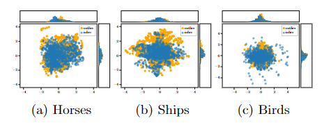

# μShift



PyTorch implementation of μShift. 
Hermann, M., Goldlücke B., & Franz M. O. (2022).  Image novelty detection based on mean-shift and typical set size. 21th International Conference on Image Analysis and Processing, ICIAP.

Cite us
```
@conference {Herm22,
	title = {Image novelty detection based on mean-shift and typical set size},
	booktitle = {21th International Conference on Image Analysis and Processing, ICIAP},
	year = {2022},
	author = {Matthias Hermann and Bastian Goldl{\"u}cke and Matthias O. Franz}
}
```
